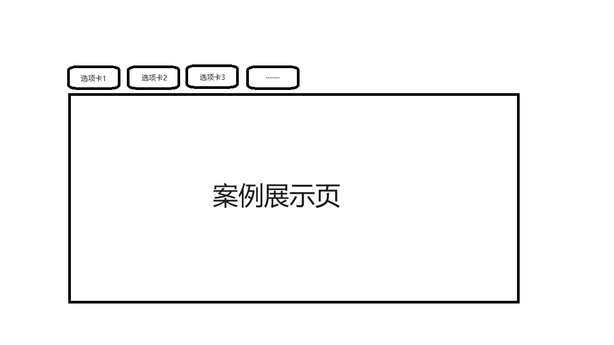

# 搭建整体布局

根据需求设计UI草图，思考如何实现UI交互。

需求：因为是练手项目，所以在该项目中要能包含各种不同的案例（demo），每个案例有一个对应的按钮入口
，通过点击该按钮切换到该案例。

分析：可以使用TabControl控件来实现该功能，或者自己设计布局和实现交互逻辑。这里我们采用第一种实现方式。

## UI草图

## 开发思路
1. 体验TabControl
2. 使用binding绑定选项卡内容（多种方法，后台纯代码绑定，将数据源放入datacontext，x:static(有限制)）
3. 了解TabControl的组成（TabPanel和Border）
4. 自定义TabItem模板

TabPanel:处理TabControl上TabItem对象的布局，另外它自动响应选项卡的选择变化，调整对应的选项卡可见性以及内容区域的切换。  
ContentPresenter的ContentSource属性：
假设给该属性赋值“Abc”，那么相当于：
- 给 Content赋值Abc
- 给 ContentTemplate赋值AbcTemplate
- 给ContentTemplateSelector赋值AbcTemplateSelector
- 如果framework版本在3.5之后，还会赋值 ContentStringFormat为AbcStringFormat

（无需深入理解，简单理解为，设置ContentSource属性会将控件模板里的内容指定为目标控件中的某个属性）

## 按钮UI设计
要求：文字居中，边框与文字留有一定空隙，边框自适应文字大小，背景颜色从橙到黄渐变，圆角。  

