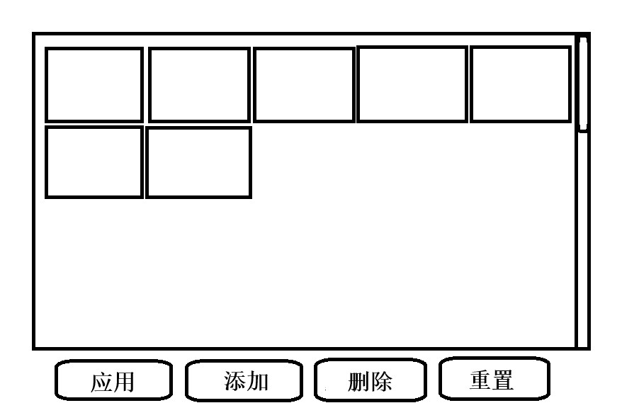

# 背景图片设置

## 需求分析
需求：实现一个图片列表和功能区，功能区中有四个按钮分别实现
应用图片，添加图片，删除图片和重置背景功能。  
其中，应用和删除功能需要先选中图片（有明显的选中标识）    
  
分析：
1. 整体用dockpapnel布局
1. 图片列表用wrappanel，外部用scrollviewer包裹；功能区用stackpanel
1. 添加图片：把图片保存到程序生成路径下，图片名和动态生成的图片框名一致
1. 选中图片时，获取这个控件的名字，存储到当前窗体类中，并在列表中高亮显示
1. 应用时，通过路由事件将图片名传递给外层父窗体
1. 删除时，删除本地图片，再移除对应图片框
1. 重置时，通过路由事件告知父窗体重置为默认背景色