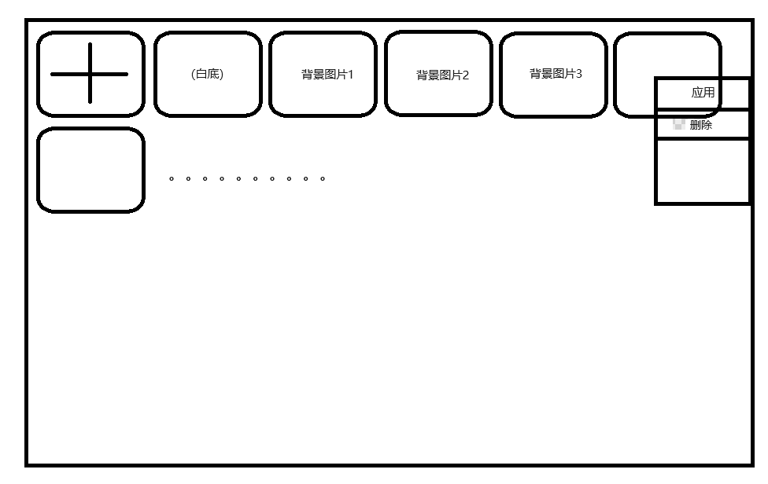

# 背景设置

## 需求分析

需求：先看图片    
1. 点击带“+”符号的框，弹出图片选择对话框，等待用户选取图片后，将图片追加到列表中
2. 点击白底框，将背景图片置空，背景为白底
3. 双击图片框，将该图片设置为应用的背景图
4. 右键图片框，可以“应用”或“删除”图片
5. 窗体最大化时，应将图片框大小放大一些，同理对于窗体小化

分析：可以使用wrapanel作为图片列表容器，因为wrappanel的特点是如果当前行/列空间不足，会自动切换到下一行/列来放置子控件。
对于图片框大小自适应功能，可以在wrappanel高度变化时实时改变所有内部图片框的大小。对于应用背景图片功能，可以给该用户控件
自定义一个改变背景图片事件，然后让外面的tabcontrol监听这个事件，事件触发时执行一个改变自身背景图片的方法。其他功能无难点。

## 开发思路
1. 研究如何给用户控件自定义路由事件，触发事件时如何把图片参数带过去